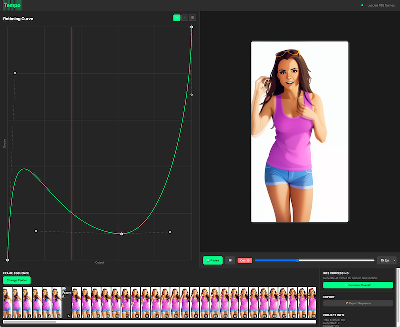

# TEMPO:  Pre alpha

This is a first pre-alpha prototype.

Video frame retiming in browser, proof of concept. Expect bugs!

**Chrome and Edge** only - test it out at
[https://electricazimuth.github.io/tempo/](https://electricazimuth.github.io/tempo/)

___

# Project Specification: "Tempo" - A Frame-Based Video Retiming Tool

**Document Version:** 1.0

## 1. Project Background & Vision

"Tempo" will be a desktop application that provides filmmakers, animators, and VFX artists with an intuitive tool for retiming video sequences. Unlike traditional video editors, Tempo operates on a sequence of numbered image frames (e.g., `frame.0001.png`, `frame.0002.png`, ...), which is a standard workflow in professional post-production.

The core feature is a user-manipulable curve that dictates the playback speed of the frame sequence. Slowing down the sequence will trigger AI-powered frame interpolation (RIFE) to create smooth, high-quality slow-motion.

Our development strategy is **"Web First, Native Second."** We will build the core application as a modern, single-page web application that runs entirely in the browser. This allows for rapid UI development, easy testing, and instant deployment for user feedback. Subsequently, we will package this web application into an Electron shell to provide a superior, "local-first" desktop experience with deep filesystem integration.

## 2. Core Functional Requirements

#### 2.1. Frame Sequence Ingestion
*   **F1.1:** The user must be able to select a local folder containing a numbered sequence of image frames Phase 1 support is only PNG/JPG.
*   **F1.2:** The application must parse the file names to identify the frame numbers and sort the sequence correctly.
*   **F1.3:** A visual timeline or "filmstrip" view shall display thumbnails of the loaded frames in sequence.

#### 2.2. Retiming Curve Editor
*   **F2.1:** A 2D graph editor shall be displayed. The X-axis represents the *output* timeline (e.g., frames 0-100), and the Y-axis represents the *input* source frame number.
*   **F2.2:** By default, the curve should be a linear 1:1 mapping (a straight diagonal line), representing real-time playback.
*   **F2.3:** Users must be able to add, delete, and move keyframes (control points) on this curve.
*   **F2.4:** The curve segments between keyframes should be manipulable (e.g., using Bézier handles) to control the easing of the speed change.
*   **F2.5:** A flat horizontal line on the curve signifies a freeze-frame. A steep vertical line signifies a speed-up. A shallow line signifies a slow-down.

#### 2.3. Real-time Playback Preview
*   **F3.1:** A video preview window shall display the retimed sequence based on the current state of the timing curve.
*   **F3.2:** The preview should play back in real-time (e.g., at 24/30 FPS).
*   **F3.3:** **Speed-up:** When the curve dictates a speed faster than real-time, source frames will be dropped/skipped.
*   **F3.4:** **Slow-down (Preview Mode):** When the curve dictates a speed slower than real-time, the preview shall generate a simple, real-time cross-fade (alpha blend) between the two surrounding source frames. This provides an immediate, interactive feel without waiting for AI processing.
*   **F3.5:** Standard playback controls (Play, Pause, Seek, Loop) must be available for the preview.

#### 2.4. AI Frame Generation (RIFE Interpolation)
*   **F4.1:** The application will have a "Render Intermediates" or "Generate Slow-Mo Frames" button with a pre-flight confirmation dialog.
*   **F4.2:** On activation, the application will analyze the timing curve to identify all instances where new frames need to be generated (i.e., between existing frames in slow-motion segments).
*   **F4.3:** For each required intermediate frame, the application will send the two bracketing source frames (Frame A and Frame B) to a designated RIFE API endpoint.
*   **F4.4:** The application will receive the generated intermediate frame from the API and display it in the timeline. The new frame should be visually distinct (e.g., different color on the filmstrip) to indicate it is a generated frame.
*   **F4.5:** The playback preview will now use these newly generated frames instead of the real-time cross-fade for the smoothest possible preview.

#### 2.5. Export
*   **F5.1:** Users must be able to export the final retimed sequence as a new folder of numbered image frames.
*   **F5.2:** The export process must respect the retiming curve, including both dropped frames (speed-up) and newly generated frames (slow-down).

---

## 3. Technical Architecture & Phased Rollout

This project will be developed in two primary phases.

#### **Phase 1: Hosted Web Application**

The initial goal is to build a fully functional application using standard web technologies. This version will be hosted on a static web host and will serve as our core product and testing ground.

*   **Language:** TypeScript
*   **UI Framework:** React (or Vue/Svelte, TBD by team)
*   **Rendering Engine for Preview:** **WebGL**. The real-time cross-fade preview is performance-critical. This will be implemented with a simple fragment shader that takes two frame textures and a blend factor as inputs. Libraries like **Three.js** or **Pixi.js** are recommended to manage the WebGL context.
*   **Curve Editor:** **SVG** or a specialized library like **D3.js** for its powerful data visualization and interaction capabilities.
*   **File System Interaction:** Use the **`File System Access API`** (`window.showDirectoryPicker()`).
    *   **Known Limitation:** We acknowledge this API will require the user to re-select their folder on each new session. This is an accepted trade-off for the rapid development and deployment of Phase 1.
*   **RIFE API Communication:** Standard `fetch` API calls to the REST endpoint. Frame data will be sent (e.g., as FormData or Base64 JSON payload) and received.
*   **Architecture Strategy:** All file system and API interactions should be abstracted into a dedicated service module (e.g., `services/platform.js`). This will isolate the browser-specific code and make the transition to Phase 2 seamless.

#### **Phase 2: Electron Application**

Once the web application is stable and feature-complete, we will package it into an Electron application to provide a premium, native desktop experience. This phase is primarily about replacing the browser's sandboxed APIs with native OS capabilities.

*   **Electron Shell:** Create an Electron project that loads the built web application (from Phase 1) into a `BrowserWindow`.
*   **File System Abstraction:**
    *   Create a new version of the `services/platform.js` module for Electron.
    *   Use Electron's **IPC (Inter-Process Communication)** and a **preload script** as the bridge between the web UI (Renderer Process) and the Node.js backend (Main Process).
    *   The Main Process will use Node's `fs` module to handle all file reading/writing and `dialog.showOpenDialog` for a native folder picker.
    *   The app will now have the ability to remember the user's last project path and provide a true "local-first" experience without repeated prompts.
*   **API Calls:** All `fetch` calls to the RIFE API will be moved from the Renderer to the Main process. This eliminates any potential CORS issues.
*   **Native Features:** We will add native OS menu bars ("File > Open Folder", etc.) for better desktop integration.
*   **Build & Distribution:** Implement an automated build process using a tool like **`electron-builder`** to create installers for macOS, Windows, and Linux.

## 4. Definition of Done

*   **Phase 1 Complete:** The application is deployed and accessible via a URL. All core features (F1-F5) are functional within the known limitations of the browser's sandbox. The code is structured with the platform abstraction layer in place.
*   **Phase 2 Complete:** The Electron application is buildable for all target platforms (macOS, Windows). The user experience for file handling is seamless and persistent. The application is ready for distribution as a downloadable installer.

